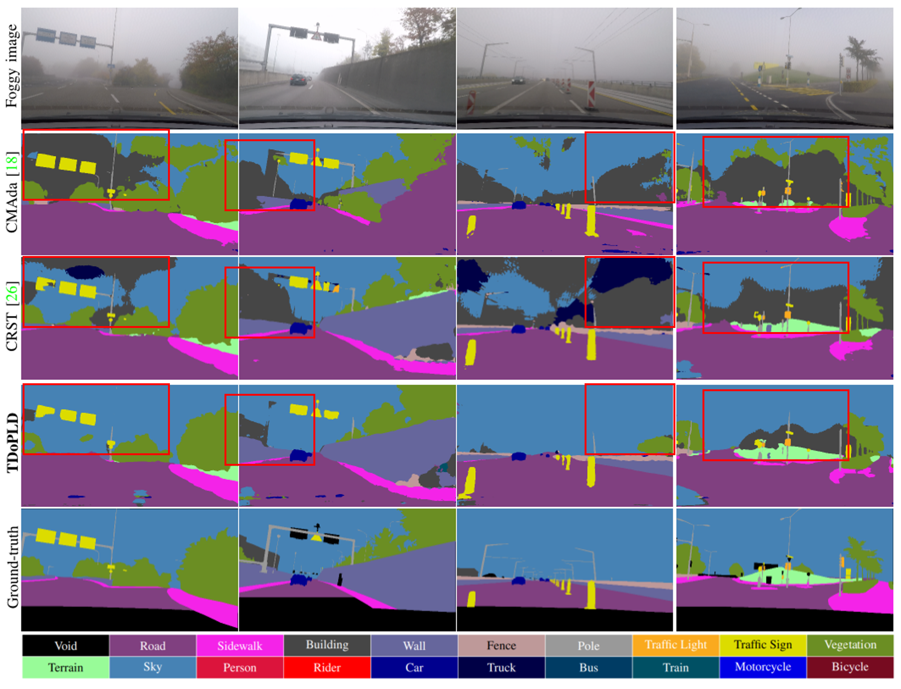

# TDo-Dif


This is a [PyTorch](http://pytorch.org/) implementation of CanDA

[English](./README.md) | 中文

## 依赖库安装

这里有两种安装方式:

1. 根据仓库中提供的env.yml进行安装，假设您已安装anaconda3
   
   ```bash
   conda env create -f env.yml
   ```

2. 您手动安装，所需的依赖库为（可能包含不必要的库）
   
   ```yml
   conda:
       python=3.7.10
       pytorch=1.7.1
       torchaudio=0.7.2
       torchvision=0.8.2
       numpy=1.20.2
   pip:
       imageio==2.9.0
       matplotlib==3.4.2
       natsort==7.1.1
       opencv-python==4.5.2.54
       scipy==1.7.0
       visdom==0.1.8.9
       tqdm==4.61.1
       scikit-learn==0.24.2
       scikit-image==0.18.2
   ```

## 数据集准备

- Cityscape数据集
  
  您可以从[官网](https://www.cityscapes-dataset.com/)下载此数据集，然后解压，此数据集结构为
  
  ```
  /cityscapes
      /gtFine
      /leftImg8bit
  ```

- FoggyZurich与FoggyDriving数据集
  
  这两个数据集都可以从作者的[网站](https://people.ee.ethz.ch/~csakarid/Model_adaptation_SFSU_dense/)下载
  
  FoggyZurich的主要结构为
  
  ```
  /Foggy_Zurich
      /gt_color
      /gt_labelIds
      /gt_labelTrainIds
      /lists_file_names
      /RGB
  ```
  
  FoggyDriving数据集的主要结构为
  
  ```
  /Foggy_Driving
      /gtCoarse
      /gtFine
      /leftImg8bit
      /lists_file_names
      /scripts
  ```


## 测试CanDA

| Model         | Network   | Dataset       | mIoU  | BaiduYun                                                                                                          |
|:-------------:|:---------:|:-------------:| ----- | ----------------------------------------------------------------------------------------------------------------- |
| base model    | RefinNet  | Foggy Zurich  | 40.02 | [link](https://pan.baidu.https://pan.baidu.com/s/1Z0Cl5yAxSqHYwXmzfAxtAgcom/s/1Z0Cl5yAxSqHYwXmzfAxtAg) code: zz6z |
| CanDA-zurich  | RefinNet  | Foggy Zurich  | 52.18 | [link](https://pan.baidu.com/s/1XhsD27XGmCLEJabbC0CHGw) code: tx32                                                |

下载好数据集与上表中的模型后，运行下面的代码,注意target_dataset为三选一，target_data_root与source_data_root改为您的数据集的路径,ckpt为您的模型的路径

```bash
python main.py --source_dataset cityscapes --source_data_root your_citiscapes_dataset_path --target_dataset FoggyDriving|FoggyZurich --target_data_root your_target_dataset_path  --gpu_id 0 --batch_size 1 --val_batch_size 1 --ckpt checkpoints/xxx.pth --save_val_results --model rf101_contrastive --test_only --usegpu
```

## 训练CanDA

下载相应数据集，以及模型，然后运行一下代码

```bash
python main.py --source_dataset cityscapes --source_data_root your_citiscapes_dataset_path --target_dataset FoggyDriving|FoggyZurich|ACDC --target_data_root your_target_dataset_path  --gpu_id 0 --batch_size 1 --val_batch_size 1 --ckpt checkpoints/xxx.pth --epoch_one_round 10 --save_val_results --model refineNet --usegpu --save_model_prefix none --train_type CRST_sp_with_loss_lp_constract --seg_num 500 --init_target_portion 0.2 --round_idx 0
```

事实上训练过程分为两个阶段，第一阶段生成并处理伪标签，第二阶段开始训练，如果您只想完成第一阶段，可以添加`--only_generate`, 如果已经完成第一个阶段，则可以添加以下参数跳过第一阶段 `--skip_thresh_gen --skip_p_gen --skip_sp_extend`

对于Foggy Zurich数据集则有点特殊，需要分别在两种浓度的雾上面训练，在薄雾上训练的示例代码为

```bash
python main.py --source_dataset cityscapes --source_data_root your_citiscapes_dataset_path --target_dataset FoggyZurich --target_data_root your_target_dataset_path  --gpu_id 0 --batch_size 1 --val_batch_size 1 --ckpt checkpoints/xxx.pth --epoch_one_round 10 --save_val_results --model refineNet --usegpu --save_model_prefix none --train_type CRST_sp_with_loss_lp_constract --seg_num 500 --init_target_portion 0.2 --round_idx 0 --train_dataset_type light
```

在中雾上进行训练时需要薄雾上的伪标签一同参与训练，所以需要先生成薄雾的伪标签

```bash
python main.py --source_dataset cityscapes --source_data_root your_citiscapes_dataset_path --target_dataset FoggyZurich --target_data_root your_target_dataset_path  --gpu_id 0 --batch_size 1 --val_batch_size 1 --ckpt checkpoints/xxx.pth --epoch_one_round 10 --save_val_results --model refineNet --usegpu --save_model_prefix none --train_type CRST_sp_with_loss_lp_constract --seg_num 500 --init_target_portion 0.2 --round_idx 0 --train_dataset_type light --only_generate
```

然后再运行

```bash
python main.py --source_dataset cityscapes --source_data_root your_citiscapes_dataset_path --target_dataset FoggyZurich --target_data_root your_target_dataset_path  --gpu_id 0 --batch_size 1 --val_batch_size 1 --ckpt checkpoints/xxx.pth --epoch_one_round 10 --save_val_results --model refineNet --usegpu --save_model_prefix none --train_type CRST_sp_with_loss_lp_constract --seg_num 500 --init_target_portion 0.2 --round_idx 0 --train_dataset_type medium --light_pseudo_label_path results/foggyzurich_prefix_round_0_light_CRST_sp/500_muti_views_labels_intra
```

## 结果

在两个数据集上的结果(包含每个类的结果)如下，




